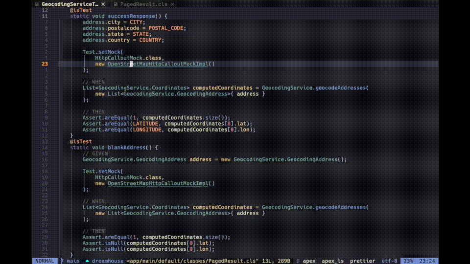

<p align="center">
  <h3 align="center">salesforcedx.nvim</h3>
</p>

[Neovim](https://neovim.io/) plugin that allows you to use the Salesforce CLI,
similar to the
[Visual Studio Code](https://marketplace.visualstudio.com/items?itemName=salesforce.salesforcedx-vscode-core)
plugin, but for your favorite code editor.

## Prerequisites

- A [NerdFont](https://www.nerdfonts.com/) (optional, but needed to display
  some icons)
- [Salesforce CLI](https://developer.salesforce.com/tools/salesforcecli)
- [nvim-treesitter](https://github.com/nvim-treesitter/nvim-treesitter) with
  [apex](https://github.com/aheber/tree-sitter-sfapex) support
- nvim-notify
- plenary

## Installation

You can install salesforcedx.nvim with any plugin manager.

### [lazy.nvim](https://github.com/folke/lazy.nvim)

```lua
{
  "cdelmoral/salesforcedx.nvim",
  dependencies = {
    "nvim-lua/plenary.nvim",
    "nvim-telescope/telescope.nvim",
    "rcarriga/nvim-notify",
  },
  config = function()
    require("salesforcedx").setup()
  end,
}
```

## Usage

salesforcedx.nvim provides the `SalesforceDX` command that opens the Salesforce
command palette:

<p align="center">
  
</p>

You can also configure key mappings to execute the Salesforce commands, for
example:

```lua
vim.keymap.set("n", "<leader>sfd", '<cmd>lua require("salesforcedx.commands").deploy_start()<CR>')
vim.keymap.set("n", "<leader>sft", '<cmd>lua require("salesforcedx.commands").execute_test_method()<CR>')
vim.keymap.set("n", "<leader>sfT", '<cmd>lua require("salesforcedx.commands").execute_test_class()<CR>')
vim.keymap.set("n", "<leader>sfa", '<cmd>lua require("salesforcedx.commands").generate_apex_class()<CR>')
```

## Status Line Integration

salesforcedx.nvim includes the `get_default_target_org` function which can be
used to display the configured default scratch org in the status line.

For example, for [lualine.nvim](https://github.com/nvim-lualine/lualine.nvim)
add this to your configuration:

```lua
{
  require("salesforcedx").get_default_target_org,
  cond = require("salesforcedx").is_salesforce_project_directory,
  icon = { "󰅟", align = "left", color = { fg = "cyan" } },
}
```
